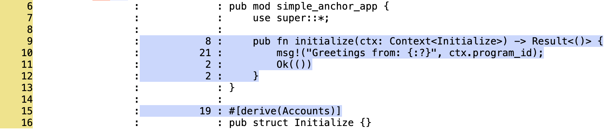
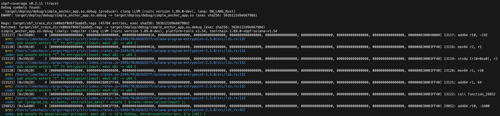

# sbpf-coverage

A tool for computing test code coverage of Solana programs and providing trace disassembly mapping between SBPF instructions and source code.





## Prerequisites

Install `lcov` to generate HTML coverage reports:

```sh
# macOS
brew install lcov

# Ubuntu/Debian
sudo apt install lcov

# Fedora
sudo dnf install lcov
```

## Steps to use for code coverage

1. Add the following to `[profile.release]` section of your Solana program's Cargo.toml:

   ```toml
   debug = true
   lto = "off"
   opt-level = 0
   ```

   This tells Cargo to build with debug information, without optimizations.
   Be sure to also use SBF Version 1 allowing for dynamic stack frames. This is necessary
   in the case of working without optimizations. Also be sure to use the latest platform-tools version v1.51 or higher.

   ```sh
   cargo build-sbf --debug --tools-version v1.51 --arch v1
   ```

   Note: from `solana-cargo-build-sbf` 4.0.0 onwards, building with `--debug` outputs the artifacts to `target/deploy/debug` instead of `target/deploy`.

2. Execution:

   This tool is agnostic from the framework used (Anchor, StarFrame, Typhoon)
   for collecting the tracing data. In other words it's up to the user to
   generate the register tracing data which can later be ingested with this tool.

   For example in the case of having a few Rust/TS tests for your program using facilities that support register tracing -
   `LiteSVM` (since `0.9.0`) or `mollusk` (since `0.8.1`) you would typically do:

   ```sh
   SBF_TRACE_DIR=$PWD/sbf_trace_dir cargo test -- --nocapture
   ```

   After the tests are finished the register tracing data will be dumped into `sbf_trace_dir`
   and this is the data this tool can ingest and generate code coverage statistics on top of.

   Finally after having executed your tests:

   ```sh
   RUST_BACKTRACE=1 sbpf-coverage \
      --src-path=$PWD/programs/myapp/src/ \
      --sbf-path=$PWD/target/deploy \
      --sbf-trace-dir=$PWD/sbf_trace_dir
   ```

   This would work for a program called myapp.

3. Run the following command to generate and open an HTML coverage report:

   ```sh
   genhtml --output-directory coverage sbf_trace_dir/*.lcov --rc branch_coverage=1 && open coverage/index.html
   ```

## Trace disassembly usage

In addition to generating coverage data, `sbpf-coverage` can also provide a mapping between
program counters, SBPF disassembly, and your native source code. This is useful for understanding
exactly which instructions correspond to which lines of your program.

For experimenting, build with optimizations enabled and ensure debug information is preserved.
Use `-Copt-level=2` or `-Copt-level=3` depending on the optimization level you want to inspect:

```sh
RUSTFLAGS="-C strip=none -C debuginfo=2 -Copt-level=2" cargo-build-sbf --tools-version v1.53 --debug
```

For probably the closest to production-like code:

```sh
RUSTFLAGS="-C strip=none -C debuginfo=2" cargo-build-sbf --tools-version v1.53 --debug -- --release
```

> **Note:** Currently `--debug` tells `cargo-build-sbf` to build *without* `--release`, which
> means no optimizations, and outputs artifacts to `target/deploy/debug` instead of `target/deploy`.
> The `RUSTFLAGS` above override this by forcing the desired opt-level.
> For a fully production-like build, you would also want LTO (`lto = "thin"` or `lto = "fat"`)
> and `codegen-units = 1`, but these are only applied in `--release` mode.
> Since [agave#11015](https://github.com/anza-xyz/agave/pull/11015) got merged,
> `cargo-build-sbf` now supports building with `--release` while preserving the debug
> sections (`.so.debug`). This produces probably the most accurate disassembly mapping against
> production-like code. Additionally, Blueshift's
> [sbpf-linker](https://github.com/blueshift-gg/sbpf-linker/pull/19) can also preserve debug
> sections in optimized release builds.

To use this feature, first collect the register tracing data (since [mollusk#199](https://github.com/anza-xyz/mollusk/pull/199) and LiteSVM 0.10.0) with `SBF_TRACE_DISASSEMBLE` set:

```sh
SBF_TRACE_DISASSEMBLE=1 SBF_TRACE_DIR=$PWD/sbf_trace_dir cargo test -- --nocapture
```

This will generate `.trace` files alongside the register dumps in `sbf_trace_dir`. Then run:

```sh
sbpf-coverage \
   --src-path=$PWD/programs/myapp/src/ \
   --sbf-path=$PWD/target/deploy/debug \
   --sbf-trace-dir=$PWD/sbf_trace_dir \
   --trace-disassemble
```

The output shows each executed instruction alongside its disassembly, source file location, and
the corresponding line of source code. To disable colored output (e.g. when piping to a file),
pass `--no-color`.

## Examples

- [upstream-pinocchio-escrow](https://github.com/procdump/upstream-pinocchio-escrow/tree/debug_info_from_upstream_ebpf) — A Pinocchio escrow program built with upstream eBPF and debug info preserved. Demonstrates both code coverage and trace disassembly.
- [surfpool-examples#6](https://github.com/txtx/surfpool-examples/pull/6) — An example Anchor app using Surfpool. Demonstrates both code coverage and trace disassembly.

## Known problems

`sbpf-coverage` uses Dwarf debug information, not LLVM instrumentation-based coverage, to map instructions to source code locations. This can have confusing implications. For example:

- one line can appear directly before another
- the latter line can have a greater number of hits

The reason is that multiple instructions can map to the same source line. If multiple instructions map to the latter source line, it can have a greater number of hits than the former.

The following is an example. The line with the assignment to `signer` is hit only once. But the immediately following line is hit multiple times, because the instructions that map to it are interspersed with instructions that map elsewhere.

```rs
            5 :     pub fn initialize(ctx: Context<Initialize>) -> Result<()> {
            1 :         let signer = &ctx.accounts.signer;
            4 :         let pubkey = signer.signer_key().unwrap();
           11 :         msg!("Signer's pubkey is: {}", pubkey);
            1 :         Ok(())
            1 :     }
```

## Troubleshooting related to code coverage (unrelated to trace disassembly)

- If you see:
  ```
  Line hits: 0
  ```
  Check that you added `debug = true` to the `[profile.release]` section of your project's root Cargo.toml. Again, it's desirable to turn off optimizations which implies dynamic stack frames at the moment of this writing.
